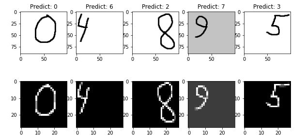
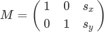
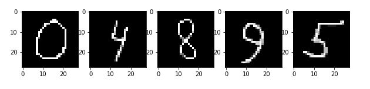

В интернете можно найти 1000 и 1 статью по тренингу мнистовского датасета для
распознавания рукописных чисел. Однако когда дело доходит до практики и начинаешь
распознавать собственные картинки, то модель справляется плохо или не 
справляется вовсе. Конечно же мы можем перевести картинку в оттенки серого, 
насильно поменять размер под мнистовский на 28x28 пикселей, и тогда наша сеть 
будет работать с подобными картинками:


Естественно, основная проблема состоит в том, что произвольная картинка сильно 
отличается от базы картинок MNIST. Исходные MNIST-овские цифры помещаются в 
квадратную картинку 20x20 пикселей. Затем вычисляется центр масс изображения и 
оно располагается на поле размера 28x28 пикселей таким образом, чтобы центр масс
совпадал с центром поля. Именно к такому виду мы и должны подгонять наши данные.

Используем любую реализацию модельки для распознавания MNIST-овских чисел. 

```
from tensorflow.keras.datasets import mnist
from tensorflow.keras.utils import to_categorical
from tensorflow.keras.models import Sequential
from tensorflow.keras.layers import Conv2D
from tensorflow.keras.layers import MaxPooling2D
from tensorflow.keras.layers import Dense
from tensorflow.keras.layers import Flatten
from tensorflow.keras.optimizers import SGD
 
# load train and test dataset
def load_dataset():
  # load dataset
  (trainX, trainY), (testX, testY) = mnist.load_data()
  # reshape dataset to have a single channel
  trainX = trainX.reshape((trainX.shape[0], 28, 28, 1))
  testX = testX.reshape((testX.shape[0], 28, 28, 1))
  # one hot encode target values
  trainY = to_categorical(trainY)
  testY = to_categorical(testY)
  return trainX, trainY, testX, testY
 
# scale pixels
def prep_pixels(train, test):
  # convert from integers to floats
  train_norm = train.astype('float32')
  test_norm = test.astype('float32')
  # normalize to range 0-1
  train_norm = train_norm / 255.0
  test_norm = test_norm / 255.0
  # return normalized images
  return train_norm, test_norm
 
# define cnn model
def define_model():
  model = Sequential()
  model.add(Conv2D(32, (3, 3), activation='relu', kernel_initializer='he_uniform', input_shape=(28, 28, 1)))
  model.add(MaxPooling2D((2, 2)))
  model.add(Conv2D(64, (3, 3), activation='relu', kernel_initializer='he_uniform'))
  model.add(Conv2D(64, (3, 3), activation='relu', kernel_initializer='he_uniform'))
  model.add(MaxPooling2D((2, 2)))
  model.add(Flatten())
  model.add(Dense(100, activation='relu', kernel_initializer='he_uniform'))
  model.add(Dense(10, activation='softmax'))
  # compile model
  opt = SGD(learning_rate=0.01, momentum=0.9)
  model.compile(optimizer=opt, loss='categorical_crossentropy', metrics=['accuracy'])
  return model
 
# run the test harness for evaluating a model
def run_test_harness():
  # load dataset
  trainX, trainY, testX, testY = load_dataset()
  # prepare pixel data
  trainX, testX = prep_pixels(trainX, testX)
  # define model
  model = define_model()
  # fit model
  model.fit(trainX, trainY, epochs=10, batch_size=32, verbose=1)
  # save model
  model.save('digit_model.h5')
  _, acc = model.evaluate(testX, testY, verbose=0)
  print('> %.3f' % (acc * 100.0))

# entry point, run the test harness
run_test_harness()

>>> 99.040
```

Получили довольно неплохой accuracy. Теперь возьмем наши личные картинки и 
посмотрим, что нам предоставит сеть. Самый стандартный способ препроцессинга: 
заскейлить до 28 пикселей, инвертировать цвет:

```
import cv2
import numpy as np

def rec_digit(img_path):
  img = cv2.imread(img_path, cv2.IMREAD_GRAYSCALE)
  gray = 255 - img
  
  gray = cv2.resize(gray, (28, 28))
  cv2.imwrite('gray'+ img_path, gray)
  img = gray / 255.0
  img = np.array(img).reshape(-1, 28, 28, 1)
  out = str(np.argmax(model.predict(img)))
  return out
```



Ноль распознался нормально, потому что находится по центру и расположен в целом довольно удачно. С остальными числами плохо. Получается, точность на 5 тестовых картинках всего 20 процентов.

Еще раз сформулируем главный тезис, как выглядит [датасет](http://yann.lecun.com/exdb/mnist/): The original black and white (bilevel) images from NIST were size normalized to fit in a 20x20 pixel box while preserving their aspect ratio. The resulting images contain grey levels as a result of the anti-aliasing technique used by the normalization algorithm. the images were centered in a 28x28 image by computing the center of mass of the pixels, and translating the image so as to position this point at the center of the 28x28 field.

Преобразуем все картинки к такому формату. Также отметим, что если фон не совсем белый, то мы получим что-то, сильно отличающееся от мнистовского датасета, белая цифра на черном фоне, как в примере с девяткой. Поэтому добавим пороговую обработку после считывания изображения:

```
def rec_digit(img_path):
  img = cv2.imread(img_path, cv2.IMREAD_GRAYSCALE)
  gray = 255-img
  # применяем пороговую обработку
  (thresh, gray) = cv2.threshold(gray, 128, 255, cv2.THRESH_BINARY | cv2.THRESH_OTSU)
  
  gray = cv2.resize(gray, (28, 28))
  cv2.imwrite('gray'+ img_path, gray)
  img = gray / 255.0
  img = np.array(img).reshape(-1, 28, 28, 1)
  out = str(np.argmax(model.predict(img)))
  return out
```


Теперь мы хотим поместить картинку в бокс 20x20 пикселей. Можно делать это несколькими способами. Один из вариантов - найти контур, ограничивающий цифру, взять его в качестве основного изображения и сделать resize до нужных размеров. [Пример](https://stackoverflow.com/questions/21104664/extract-all-bounding-boxes-using-opencv-python), как это можно делать. В том числе может пригодиться, если необходимо распознавать числа из более чем одной цифры.

Мы же будем делать немного проще и, с другой стороны, надежнее. А именно, сперва удалим все строки и столбцы, в которых пиксели только черные. Таким образом мы получим картинку, в точности являющейся прямоугольной оболочкой нашей цифры.

```
def rec_digit(img_path):
  img = cv2.imread(img_path, cv2.IMREAD_GRAYSCALE)
  gray = 255-img
  # применяем пороговую обработку
  (thresh, gray) = cv2.threshold(gray, 128, 255, cv2.THRESH_BINARY | cv2.THRESH_OTSU)
  
  # удаляем нулевые строки и столбцы
  while np.sum(gray[0]) == 0:
    gray = gray[1:]
  while np.sum(gray[:,0]) == 0:
    gray = np.delete(gray,0,1)
  while np.sum(gray[-1]) == 0:
    gray = gray[:-1]
  while np.sum(gray[:,-1]) == 0:
    gray = np.delete(gray,-1,1)
  rows, сols = gray.shape
  
  cv2.imwrite('gray'+ img_path, gray)
  gray = cv2.resize(gray, (28, 28))
  img = gray / 255.0
  img = np.array(img).reshape(-1, 28, 28, 1)
  out = str(np.argmax(model.predict(img)))
  return out
```


Далее хотим поменять размер картинок таким образом, чтобы они помещались в квадрат размера 20x20. Добавим фактор, чтобы наибольшая сторона была длиной в 20 пикселей:

```
def rec_digit(img_path):
  img = cv2.imread(img_path, cv2.IMREAD_GRAYSCALE)
  gray = 255-img
  # применяем пороговую обработку
  (thresh, gray) = cv2.threshold(gray, 128, 255, cv2.THRESH_BINARY | cv2.THRESH_OTSU)
  
  # удаляем нулевые строки и столбцы
  while np.sum(gray[0]) == 0:
    gray = gray[1:]
  while np.sum(gray[:,0]) == 0:
    gray = np.delete(gray,0,1)
  while np.sum(gray[-1]) == 0:
    gray = gray[:-1]
  while np.sum(gray[:,-1]) == 0:
    gray = np.delete(gray,-1,1)
  rows, сols = gray.shape
  
  # изменяем размер, чтобы помещалось в box 20x20 пикселей
  if rows > cols:
    factor = 20.0/rows
    rows = 20
    cols = int(round(cols*factor))
    gray = cv2.resize(gray, (cols,rows))
  else:
    factor = 20.0/cols
    cols = 20
    rows = int(round(rows*factor))
    gray = cv2.resize(gray, (cols, rows))
  
  cv2.imwrite('gray'+ img_path, gray)
  gray = cv2.resize(gray, (28, 28))
  img = gray / 255.0
  img = np.array(img).reshape(-1, 28, 28, 1)
  out = str(np.argmax(model.predict(img)))
  return out
```

Теперь расширяем картинку до 28x28 пикселей, добавляя черные ряды и столбцы по краям, используя функцию `np.lib.pad`, которая добавляет нули по краям. И сразу удалим строчку `gray = cv2.resize(gray, (28, 28))`. После факторизации добавляем:

```
colsPadding = (int(math.ceil((28-cols)/2.0)),int(math.floor((28-cols)/2.0)))
rowsPadding = (int(math.ceil((28-rows)/2.0)),int(math.floor((28-rows)/2.0)))
gray = np.lib.pad(gray,(rowsPadding,colsPadding),'constant')
```


В целом, картинки уже расположены довольно хорошо. Тем не менее, следующий шаг - подвинуть внутреннюю коробку таким образом, чтобы ее центр масс совпадал с центром всей картинки. Заведем две вспомогательные функции. Первая вычисляет центр масс и направление сдвига:

```
from scipy.ndimage.measurements import center_of_mass
def getBestShift(img):
    cy,cx = center_of_mass(img)

    rows,cols = img.shape
    shiftx = np.round(cols/2.0-cx).astype(int)
    shifty = np.round(rows/2.0-cy).astype(int)

    return shiftx,shifty
```

И собственно функция, которая сдвигает картинку в нужном направлении. Подробнее о [warpAffine](https://docs.opencv.org/4.x/da/d6e/tutorial_py_geometric_transformations.html#gsc.tab=0). В нашем случае следующая матрица трансформации:



```
def shift(img,sx,sy):
    rows,cols = img.shape
    M = np.float32([[1,0,sx],[0,1,sy]])
    shifted = cv2.warpAffine(img,M,(cols,rows))
    return shifted
```

Добавляем еще пару строчек со сдвигом относительно центра масс:

```
shiftx,shifty = getBestShift(gray)
shifted = shift(gray,shiftx,shifty)
gray = shifted
```

И по итогу получаем полноценный подгон под мнистовский датасет:

```
from scipy.ndimage.measurements import center_of_mass
import math 
import cv2
import numpy as np

def getBestShift(img):
    cy,cx = center_of_mass(img)
    
    rows,cols = img.shape
    shiftx = np.round(cols/2.0-cx).astype(int)
    shifty = np.round(rows/2.0-cy).astype(int)

    return shiftx,shifty
  
def shift(img,sx,sy):
    rows,cols = img.shape
    M = np.float32([[1,0,sx],[0,1,sy]])
    shifted = cv2.warpAffine(img,M,(cols,rows))
    return shifted
  
def rec_digit(img_path):
  img = cv2.imread(img_path, cv2.IMREAD_GRAYSCALE)
  gray = 255-img
  # применяем пороговую обработку
  (thresh, gray) = cv2.threshold(gray, 128, 255, cv2.THRESH_BINARY | cv2.THRESH_OTSU)
  
  # удаляем нулевые строки и столбцы
  while np.sum(gray[0]) == 0:
    gray = gray[1:]
  while np.sum(gray[:,0]) == 0:
    gray = np.delete(gray,0,1)
  while np.sum(gray[-1]) == 0:
    gray = gray[:-1]
  while np.sum(gray[:,-1]) == 0:
    gray = np.delete(gray,-1,1)
  rows,cols = gray.shape
  
  # изменяем размер, чтобы помещалось в box 20x20 пикселей
  if rows > cols:
    factor = 20.0/rows
    rows = 20
    cols = int(round(cols*factor))
    gray = cv2.resize(gray, (cols,rows))
  else:
    factor = 20.0/cols
    cols = 20
    rows = int(round(rows*factor))
    gray = cv2.resize(gray, (cols, rows))

  # расширяем до размера 28x28
  colsPadding = (int(math.ceil((28-cols)/2.0)),int(math.floor((28-cols)/2.0)))
  rowsPadding = (int(math.ceil((28-rows)/2.0)),int(math.floor((28-rows)/2.0)))
  gray = np.lib.pad(gray,(rowsPadding,colsPadding),'constant')

  # сдвигаем центр масс
  shiftx,shifty = getBestShift(gray)
  shifted = shift(gray,shiftx,shifty)
  gray = shifted
  
  cv2.imwrite('gray'+ img_path, gray)
  img = gray / 255.0
  img = np.array(img).reshape(-1, 28, 28, 1)
  out = str(np.argmax(model.predict(img)))
  return out
```

Вообще можно было бы задаться вопросом, действительно ли сдвиг относительно центра масс имеет вообще хоть какой-то толк, особенно если мы работаем с картинкой 20x20 пикселей? Разница будет, пусть и небольшая. Тем не менее, мы подогнали произвольную картинку под MNIST-овский датасет.




Как итог, моделька выше с использованием построенного препроцессинга изображений дает следующий результат:


Пост написан для https://github.com/spbu-math-cs/ml-course